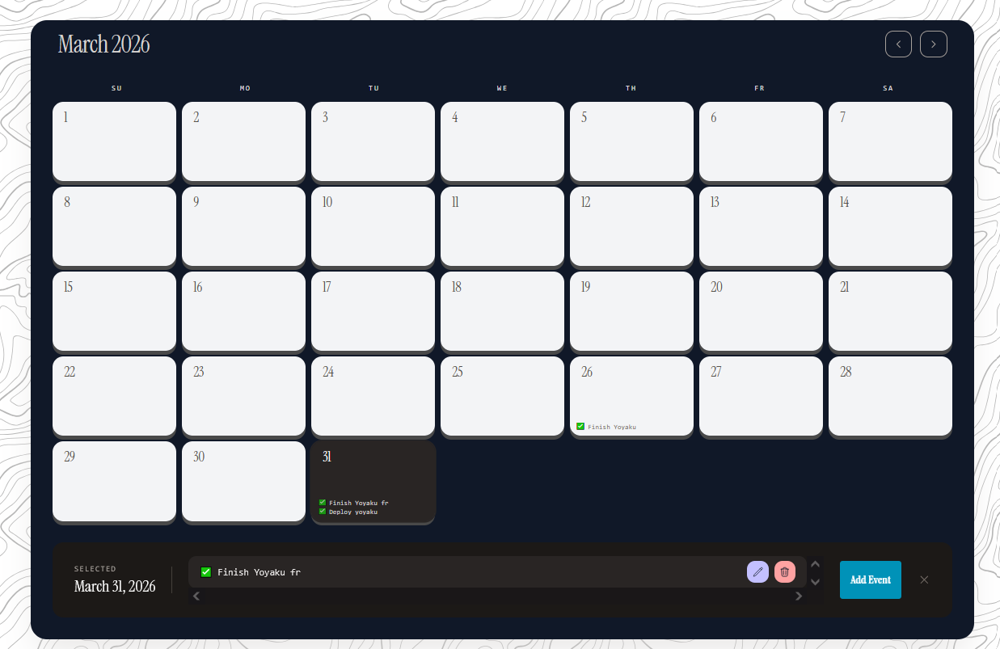

# Yoyaku

A modern, feature-rich calendar and event management application built with Angular and Firebase. Yoyaku helps you organize your schedule with intuitive event creation, categorization, and reminder features.



## ✨ Features

### Event Management
- **Create Events**: Easily add events with title, description, location, and timing details
- **Edit & Delete**: Modify or remove existing events with a simple click
- **Event Categories**: Organize events into categories:
  - 👥 Meeting
  - 📅 Appointment
  - ✅ Task
  - 🔔 Reminder
  - 🎉 Social
  - 📌 Other

### Priority System
- **Low Priority**: Green indicators for less urgent events
- **Medium Priority**: Amber indicators for standard events
- **High Priority**: Red indicators for urgent events

### Reminder System
- Configurable reminders from 5 minutes to 1 week before events
- Email notifications (when enabled)

### Calendar View
- **Month View**: Navigate through months with previous/next controls
- **Interactive Dates**: Click on any date to view or add events
- **Today Highlight**: Quick navigation to the current date
- **Event Display**: Visual indicators showing events on each date

### User Authentication
- **Email/Password**: Traditional registration and login
- **Google OAuth**: Quick sign-in with your Google account
- **Secure Storage**: Firebase authentication with encrypted data

### Data Persistence
- **Cloud Storage**: Firebase Firestore for reliable data storage
- **Local Fallback**: LocalStorage backup for offline access
- **Auto-sync**: Seamless synchronization between local and cloud data

## 🛠️ Tech Stack

### Frontend
- **Angular 21.1.0** - Modern web framework with TypeScript
- **Tailwind CSS 4.1.12** - Utility-first CSS framework
- **Angular CDK** - Component Dev Kit for advanced UI components
- **Lucide Angular** - Beautiful, consistent icon library

### Backend & Services
- **Firebase Authentication** - Secure user authentication
- **Firebase Firestore** - NoSQL database for event storage
- **Firebase Analytics** - Usage analytics and insights

### Development Tools
- **Angular CLI 21.1.5** - Command-line interface for Angular
- **TypeScript 5.9.2** - Type-safe JavaScript
- **Vitest 4.0.8** - Fast unit testing framework
- **PostCSS 4.1.12** - CSS processing
- **Prettier** - Code formatting

### Build & Deployment
- **Vercel** - Deployment platform with automatic builds
- **Angular Build** - Optimized production builds

## 🚀 Getting Started

### Prerequisites

Before you begin, ensure you have the following installed:
- [Node.js](https://nodejs.org/) (v18 or higher recommended)
- [npm](https://www.npmjs.com/) (comes with Node.js)
- [Angular CLI](https://angular.io/cli) (v21 or higher)

### Installation

1. **Clone the repository**
   ```bash
   git clone https://github.com/Joseph-kdev/Yoyaku.git
   cd Yoyaku
   ```

2. **Install dependencies**
   ```bash
   npm install
   ```

3. **Configure Firebase**
   - Create a new Firebase project at [Firebase Console](https://console.firebase.google.com/)
   - Enable Authentication (Email/Password and Google providers)
   - Enable Firestore Database
   - Copy your Firebase configuration
   - Update `src/environments/environment.ts` with your Firebase config:

   ```typescript
   export const environment = {
     apiKey: "YOUR_API_KEY",
     authDomain: "YOUR_PROJECT_ID.firebaseapp.com",
     projectId: "YOUR_PROJECT_ID",
     storageBucket: "YOUR_PROJECT_ID.appspot.com",
     messagingSenderId: "YOUR_MESSAGING_SENDER_ID",
     appId: "YOUR_APP_ID",
     measurementId: "YOUR_MEASUREMENT_ID"
   };
   ```

4. **Start the development server**
   ```bash
   ng serve
   ```

5. **Open your browser**
   Navigate to `http://localhost:4200/`

### Development Commands

```bash
# Start development server
npm start

# Build for production
npm run build

# Watch for changes
npm run watch

# Run unit tests
npm test

# Run e2e tests
ng e2e
```

### Building for Production

To create a production build:

```bash
ng build --configuration=production
```

The build artifacts will be stored in the `dist/` directory.

## 🤝 Contributing

Contributions are welcomed:

### Getting Started

1. **Fork the repository**
   Click the "Fork" button at the top right of the repository page.

2. **Clone your fork**
   ```bash
   git clone https://github.com/YOUR_USERNAME/Yoyaku.git
   cd Yoyaku
   ```

3. **Create a branch**
   ```bash
   git checkout -b feature/your-feature-name
   ```

4. **Make your changes**
   - Follow the existing code style
   - Add tests for new features
   - Update documentation as needed

5. **Commit your changes**
   ```bash
   git commit -m "Add your message here"
   ```

6. **Push to your fork**
   ```bash
   git push origin feature/your-feature-name
   ```

7. **Create a Pull Request**
   Go to the original repository and create a pull request.

### Reporting Issues

- Use the [GitHub Issues](https://github.com/Joseph-kdev/Yoyaku/issues) page
- Provide detailed descriptions and steps to reproduce
- Include screenshots when applicable

### Feature Requests

- Open an issue with the "enhancement" label
- Describe the feature and its benefits
- Be open to discussion and feedback

## 📄 License

This project is licensed under the MIT License - see the [LICENSE](LICENSE) file for details.
